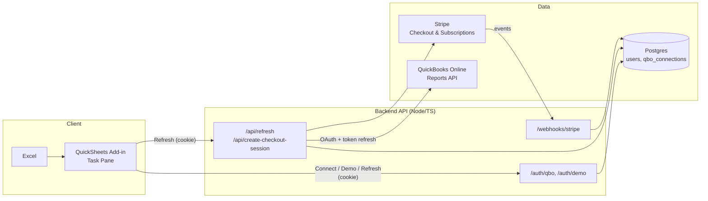

# QuickSheets

**QuickBooks → Excel in one click.** An Excel add-in that connects to QuickBooks Online and refreshes P&L, Balance Sheet, and Statement of Cash Flows into your workbook.

- **Backend:** Node/TypeScript API (QBO OAuth + Reports, Postgres for tokens).
- **Excel add-in:** Office.js task pane (Connect QuickBooks + Refresh).

## Documentation (solve most issues yourself)

| Doc | Use it when |
|-----|--------------|
| **[docs/SETUP.md](docs/SETUP.md)** | First-time setup, step-by-step backend + add-in + Intuit + optional Stripe. |
| **[docs/TROUBLESHOOTING.md](docs/TROUBLESHOOTING.md)** | Something fails: 401, 402, backend won’t start, QBO/Stripe/add-in errors. Symptom → cause → fix. |
| **[docs/ENV.md](docs/ENV.md)** | Env vars: what each one does, required vs optional, what breaks if wrong. |
| **[docs/ARCHITECTURE.md](docs/ARCHITECTURE.md)** | Where to look: request flow, session, tokens, subscription, “where do I change X?”. |
| **[CONTRIBUTING.md](CONTRIBUTING.md)** | Running quality checks, where to change code, opening a PR. |

**Prerequisites:** Node.js 18+, PostgreSQL, Intuit Developer account (for QBO), Excel. Optional: Stripe for billing. See [docs/SETUP.md](docs/SETUP.md).

**Quick troubleshooting:** Backend won’t start → [TROUBLESHOOTING](docs/TROUBLESHOOTING.md#backend-wont-start). 401 / “Connect first” → [TROUBLESHOOTING](docs/TROUBLESHOOTING.md#401-unauthorized-connect-quickbooks--refresh). 402 / subscription → [TROUBLESHOOTING](docs/TROUBLESHOOTING.md#402-payment-required). Add-in doesn’t load → [TROUBLESHOOTING](docs/TROUBLESHOOTING.md#excel-add-in-doesnt-load). CORS → [TROUBLESHOOTING](docs/TROUBLESHOOTING.md#cors-errors-in-browser).

## Architecture



**Flow (short):** User opens the add-in in Excel → **Connect QuickBooks** or **Try with demo data** hits the backend, which sets a session cookie → **Refresh Reports** calls `POST /api/refresh` with that cookie; the backend returns demo data (no QBO) or, if the user has QBO + an active subscription, fetches P&L, Balance Sheet, and Cash Flow from QuickBooks and streams them back → the add-in writes sheets `QS_PnL`, `QS_BS`, `QS_CashFlow`. Report data is not stored; it flows QBO → backend → Excel and is discarded. See [docs/ARCHITECTURE.md](docs/ARCHITECTURE.md) for where to look in code.

## Quick start

### Option A: Docker (backend + Postgres)

From the repo root:

```bash
cp backend/.env.example backend/.env
# Edit backend/.env (CORS_ORIGIN, QBO_*, STRIPE_* as needed)
docker compose up -d
```

Backend: `http://localhost:3000`. Postgres: `localhost:5432` (user `quicksheets`, db `quicksheets`). Schema runs on first start. See [docs/DOCKER.md](docs/DOCKER.md).

### Option B: Local

### 1. Backend

```bash
cd backend
cp .env.example .env
# Edit .env: DATABASE_URL, QBO_CLIENT_ID, QBO_CLIENT_SECRET, QBO_REDIRECT_URI

npm install
createdb quicksheets  # or your DB name
psql $DATABASE_URL -f db/schema.sql
npm run dev
```

- Health: `GET http://localhost:3000/health`
- OAuth start: `GET http://localhost:3000/auth/qbo`
- Callback: `GET http://localhost:3000/auth/qbo/callback?code=...&realmId=...`

### 2. Excel add-in

```bash
cd excel-addin
npm install
npm run build
```

Serve the add-in over HTTPS (required by Office). Options:

- Use **Office Add-in debugging** (`npm start` in excel-addin) and point manifest to your backend + task pane URLs.
- Or run a small static server for `excel-addin/dist` and set manifest `SourceLocation` / icon URLs to that host.

Then in Excel: **Insert → Get Add-ins → Upload My Add-in** and select `manifest.xml`.

### 3. Quality (zero errors, zero warnings)

From the repo root:

```bash
npm run quality   # format:check + lint (ESLint --max-warnings 0) + build + test
```

Or per package: `npm run lint`, `npm run format:check`, `npm run format`, `npm run build`, `npm run test` (backend Jest unit + integration). CI (GitHub Actions) runs on push/PR to `main` and `develop`: lint, format check, build, backend tests, and `npm audit`. Dependabot opens weekly PRs for `backend`, `excel-addin`, and GitHub Actions.

### 4. Flow

1. User opens QuickSheets task pane in Excel.
2. **Try with demo data** opens `/auth/demo?dialog=true` and sets a session cookie (no QBO). **Refresh Reports** then returns static demo P&L, BS, Cash Flow so you can validate the add-in without QuickBooks.
3. **Connect QuickBooks** opens `/auth/qbo?dialog=true`; user signs in with Intuit; callback sets a session cookie and posts `"connected"` to the dialog.
4. **Refresh Reports** calls `POST /api/refresh` with `credentials: "include"`. If the user has no QBO connection, demo data is returned. If they have QBO and an active subscription, backend uses stored (and refreshed) QBO tokens to fetch reports and writes to sheets `QS_PnL`, `QS_BS`, `QS_CashFlow`.

### 5. Billing (Stripe $49/mo)

- Set `STRIPE_SECRET_KEY`, `STRIPE_WEBHOOK_SECRET`, `STRIPE_PRICE_ID` (recurring $49/mo), `STRIPE_SUCCESS_URL`, `STRIPE_CANCEL_URL`.
- **Subscribe:** `POST /api/create-checkout-session` (with session cookie) returns a Stripe Checkout URL; redirect the user to pay.
- **Webhook:** `POST /webhooks/stripe` (raw body) handles `checkout.session.completed`, `customer.subscription.updated`, `customer.subscription.deleted` and updates `users.stripe_customer_id`, `stripe_subscription_id`, `subscription_status`.
- **Gate:** `/api/refresh` returns 402 unless the user has an active or trialing subscription (demo flow and “no QBO connection” flow bypass the gate).

## Project layout

```
backend/
  src/
    app.ts            # Express app (exported for tests)
    index.ts          # Starts server
    routes/
      auth.ts        # QBO OAuth, GET /auth/demo
      reports.ts     # POST /api/refresh (demo or QBO, subscription-gated)
      billing.ts     # POST /api/create-checkout-session, POST /webhooks/stripe
    services/
      quickbooks.ts  # makeQboClient (token refresh), fetch*Report
      tokens.ts      # getConnectionForUser, upsertConnection (encrypt if ENCRYPTION_KEY set)
      encryption.ts  # encrypt/decrypt tokens at rest
      stripe.ts      # hasActiveSubscription, updateUserSubscription
    middleware/
      session.ts
      security.ts    # requireHttps, validateCorsConfig
      requireSubscription.ts
    data/
      demo-reports.ts
  db/
    schema.sql       # users (incl. stripe_*, subscription_status), qbo_connections

excel-addin/
  src/
    taskpane/
      taskpane.html
      taskpane.ts    # Connect QBO, Try with demo data, Refresh → writeSheet
  manifest.xml
```

## Security

- **Tokens:** Set `ENCRYPTION_KEY` (32-byte hex or any string, hashed) to encrypt access/refresh tokens at rest. Omit in dev to store plaintext.
- **Cookies:** Session cookie is `httpOnly`, `SameSite=Lax`, and `Secure` in production.
- **HTTPS:** In production, `requireHttps` middleware enforces HTTPS (uses `X-Forwarded-Proto` behind a proxy).
- **CORS:** `CORS_ORIGIN` must be set and not `*` in production.
- **Landing / privacy:** `GET /` and `GET /privacy` state that report content is not stored; data flows QuickBooks → server → Excel and is discarded.
- **Logging:** Pino structured logs; QuickBooks report errors (including 429 rate limit) are logged for monitoring.

## Pricing

One plan: **$49/month**. Stripe Checkout + webhooks; `/api/refresh` is gated on active/trialing subscription (demo and “no QBO” flows still work without a subscription).

## References

- [Intuit OAuth 2.0 & Node](https://developer.intuit.com/app/developer/qbo/docs/develop/sdks-and-samples-collections/nodejs)
- [node-quickbooks](https://github.com/mcohen01/node-quickbooks) (reportProfitAndLoss, reportBalanceSheet, reportCashFlow)
- [Office Add-ins – Excel](https://learn.microsoft.com/en-us/office/dev/add-ins/excel/excel-add-ins-overview)

## Still stuck?

1. **Env / setup:** [docs/ENV.md](docs/ENV.md), [docs/SETUP.md](docs/SETUP.md).
2. **Errors / behavior:** [docs/TROUBLESHOOTING.md](docs/TROUBLESHOOTING.md).
3. **Code / flow:** [docs/ARCHITECTURE.md](docs/ARCHITECTURE.md), [CONTRIBUTING.md](CONTRIBUTING.md).

If you’ve checked the docs and still have an issue, open a GitHub issue with what you did, what you expected, and what happened (and env/config if relevant, with secrets redacted).
